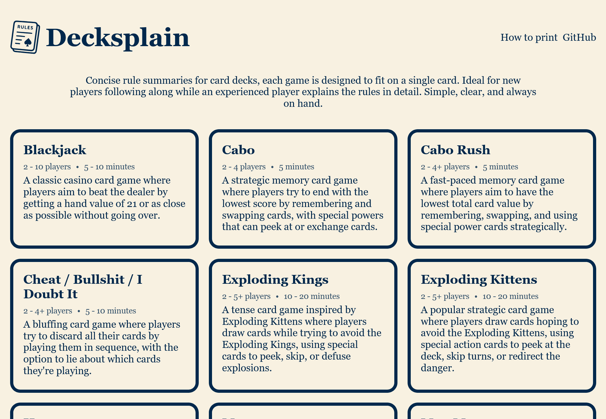

# Decksplain - card game rules

A series of classic and novel card game rules provided in a printable format.



## Development

### Technologies

- Dotnet
  - MVC Razor pages 
- Sass
- GitHub Pages

The website is built using Dotnet but the end result is statically cached and uploaded to GitHub Pages.

### Requirements

- Dotnet SDK (version defined in the `./global.json`)

### Running

```bash
dotnet run --project .\Decksplain\
```

### Releasing

Check in the workflows for a task that builds and deploys.
